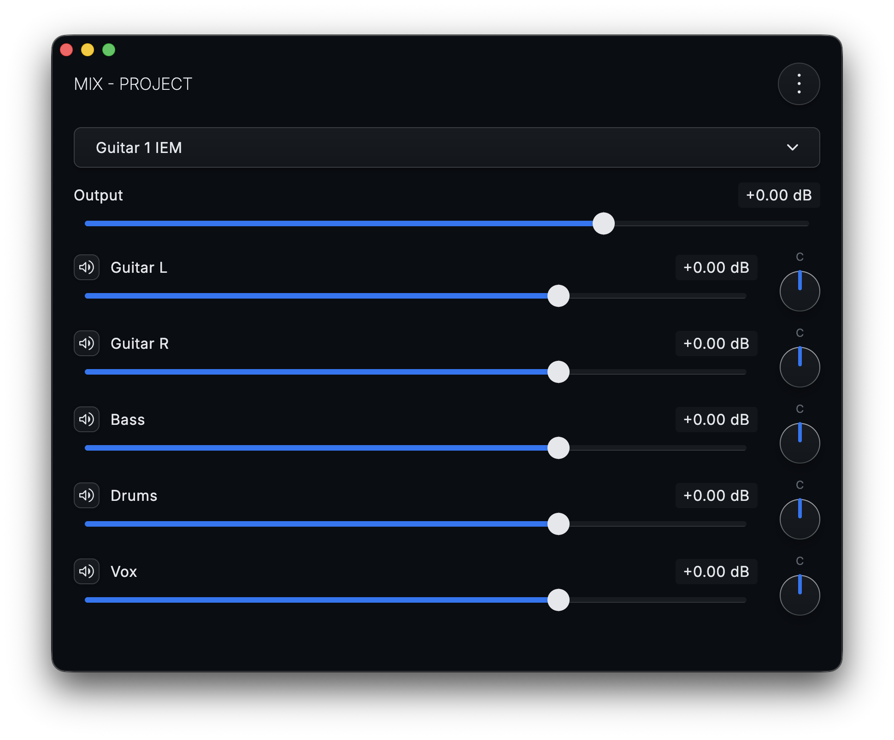

<div align="center">
    
</div>

# <div align="center">ReaCue<br><a href="https://github.com/ethossoftworks/ReaCue/releases/latest"><a/></div>
ReaCue is a personal in-ear monitor (IEM) mixing and talkback app for [REAPER](https://www.reaper.fm/) that uses Bluetooth Low Energy 
instead of Wi-Fi. A macOS host app connects to REAPER and communicates over BLE to Android and iOS clients so band 
members can adjust their own monitor mixes from their phones.

<div align="center">
    
</div>

## Why
Live IEM mixing with REAPER typically requires every device to be on the same Wi-Fi network. That means creating a 
hotspot, connecting every phone, and troubleshooting dropped connections mid-set. ReaCue eliminates that by using BLE 
as the transport layer. The macOS host connects to REAPER locally and advertises a BLE service that mobile devices can 
connect to directly. In addition, the builtin web interface for controlling monitors does not handle changing projects 
well.

## How It Works
**Host (macOS)** — Connects to REAPER via a locally bound TCP socket from the ReaCue ReaScript, reads 
  track/send/hardware output state, and advertises a custom BLE peripheral service. State updates are serialized as 
  CBOR and sent to connected mobile clients as BLE notifications.

**Client (Android/iOS)** — Scans for a ReaCue BLE host, connects, and receives the full mix state. Mix adjustments 
  made on the client are written back to the host over BLE, which forwards them to REAPER.

```
REAPER <—TCP—> macOS Host <—BLE—> Android/iOS Client
```

## Features
- Talkback - Use your phone's microphone to talk to other IEMs
- Automatic monitor track detection (tracks with hardware outs and receives, but no sends)
- Per-track monitor mix control with volume, pan, and mute controls
- Output volume control for each monitor track's hardware output
- Bulk mix actions: set all receives to 0 dB, set all to a specific percentage, or adjust all by an offset
- Live project name display and automatic project change detection
- Automatic state sync - changes made in REAPER are reflected on clients in real time
- BLE transport - no Wi-Fi or hotspot needed
- BLE security - Prevent unwanted users from accessing your IEM setup via a passcode 

## Platform Support
### Host Platforms
* MacOS

### Client Platforms
* iOS
* Android

## REAPER Setup
ReaCue requires a ReaScript to be run

1. Copy `reaperConfigs/ReaCue.eel` to your REAPER resource path's `Scripts` directory 
  (typically `~/Library/Application Support/REAPER/Scripts`)
2. (Optional) If you want ReaCue to run automatically on Reaper startup, Create or edit `__startup.eel` in the `Scripts` directory 
  and add the following lines (replacing `[action_command_id]` with your actual command id found in the Reaper actions 
  window:
   ```eel
   cmd = NamedCommandLookup("[action_command_id]");
   cmd > 0 ? Main_OnCommand(cmd, 0);
   ```
3. (Optional) If you want to use the Talkback feature, copy `reaperConfigs/ReaCue Talkback.jsfx` to your resource path's
  `Effects` directory.
4. Restart REAPER

**Note:** it is possible to change the TCP port ReaCue serves by editing ReaCue.eel and modifying the TCP_PORT variable.

**Note:** for security reasons, the ReaCue TCP port is only available on localhost. The host application listens to
the TCP port and advertises BLE for all clients.

### REAPER Track/IEM Setup

For a track to appear as a selectable monitor in ReaCue, it must have both **receives** (sends from other tracks into it) 
and at least one **hardware output**. A typical setup:

1. Create a monitor track for each band member
2. Add sends from each source track (vocals, guitar, drums, etc.) to the monitor track
3. Route the monitor track to a hardware output on your audio interface 

### Talkback Setup
If you want to use the talkback feature you can set it up in one of three ways:
#### Per IEM FX (Recommended))
Add an FX instance of `ReaCue Talkback` to each monitor track. Each band member should select a unique
talkback channel in their app settings and change the `Channel Filter` option in `ReaCue Talkback` to match. Using the
`Channel Filter` option prevents speech jamming yourself when you're trying to talk due to the natural latency of BLE
and audio capture.

#### Per IEM Track Receive
Add a separate talkback Track for each IEM and configure it to send only to the correct IEM track. Follow the rest of 
steps from above to avoid speech jamming.

#### Global Talkback (Not recommended)
Create a single "Talkback" track, add a `ReaCue Talkback` FX to it, and send it to all monitor tracks. Using this method
there is no way to filter out your own voice to avoid speech jamming. However, this is the simplest method.

## Getting Started
1. Make sure the REAPER Setup instructions have been followed
2. Open Reaper
3. Open ReaCue on host machine (macOS)
4. Open ReaCue on client machine (iOS, Android)

## Technical Design
To read more about the technical design, read the [Technical Design Journey](docs/TECHNICAL_DESIGN_JOURNEY.md).

## Building

### Prerequisites

- JDK 17+
- [Kotlin Multiplatform](https://kotlinlang.org/docs/multiplatform.html) toolchain via Gradle

### macOS Host

```sh
# Run in development
./gradlew :macOsApp:runDebugExecutableMacosArm64

# Build .app bundle
./gradlew :macOsApp:assembleApp
```

The built app is an ARM64 (Apple Silicon) native binary.

### Android Client

```sh
# Build debug APK
./gradlew :androidApp:assembleDebug
```

- Min SDK: 28 (Android 9)
- Target SDK: 36

Or open the project in Android Studio and run the `androidApp` configuration.

### iOS Client

1. Open `iosApp/ReaCue.xcodeproj` in Xcode
2. Select a development team under **Signing & Capabilities**
3. Build and run on a device (BLE is not available in the simulator)

## Roadmap
1. Presets - Storing values for tracks based on name for later recall
2. Talkback - Allow using the phone microphone to talk to other band members with IEMs in

## License

[MIT](LICENSE) — Copyright (c) 2026 Ethos Softworks and Ryan Mitchener
